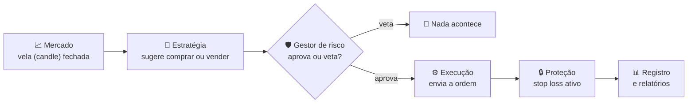

# 🤖 Trade Bot — um robô de trade pessoal, feito para aprender e testar, não para prometer lucro

📚 Quer os detalhes técnicos (arquitetura, endpoints, schemas, scripts)? Veja
[docs/TECNICO.md](docs/TECNICO.md).

> ⚠️ **Aviso de risco, antes de qualquer coisa**: isto é um projeto de estudo. Ele **não
> promete e não garante lucro**. Operar criptomoedas é arriscado e você pode perder dinheiro.
> Por padrão, o bot só simula operações com dinheiro fictício (modo `PAPER`) — ele só chega perto
> de dinheiro de verdade se você ligar isso manualmente e de forma explícita. Use por sua conta e
> risco.

## 1. O que é este projeto

É um bot que observa o preço de algumas criptomoedas na Binance e, seguindo uma estratégia fixa e
transparente, decide quando "comprar" e quando "vender". A ideia não é ficar rico rápido — é ter
uma forma **segura e mensurável** de responder à pergunta "essa estratégia funcionaria de
verdade?", antes de arriscar (ou nunca) dinheiro real.

Por padrão ele roda em modo simulado, com preços reais do mercado mas dinheiro de brincadeira.
Toda decisão fica registrada, então dá pra olhar depois e ver exatamente por que ele comprou,
por que vendeu, e se deu lucro ou prejuízo.

## 2. Como ele funciona em 1 minuto



1. **Mercado**: a cada vela (candle) fechada — por exemplo, a cada hora — o bot olha o preço.
2. **Estratégia**: aplica um conjunto fixo de regras (explicadas na seção 4) e sugere "comprar",
   "vender" ou "não fazer nada".
3. **Gestor de risco**: antes de qualquer ordem sair, um segundo módulo checa se é seguro operar
   agora (tem stop definido? já perdeu demais hoje? já tem posições demais abertas?). Ele pode
   vetar a sugestão da estratégia.
4. **Execução**: só se o risco aprovar, a ordem é de fato enviada (real ou simulada, dependendo
   do modo).
5. **Proteção**: toda operação nasce com um limite de perda (stop loss) já definido — nunca fica
   uma posição "a descoberto".
6. **Registro**: tudo — decisão, motivo, resultado — fica salvo para virar relatório depois.

## 3. Quais moedas ele opera

Hoje o bot opera com uma **lista fixa** de pares, configurada em `.env` (`TREND_SYMBOLS`):

| Par | O que significa |
|---|---|
| `BTCUSDT` (padrão) | Comprar/vender Bitcoin usando USDT (um "dólar digital" estável, 1 USDT ≈ 1 dólar) |
| `ETHUSDT` (padrão) | Comprar/vender Ethereum usando USDT |

**Importante**: hoje não existe uma lista "inteligente" que escolhe moedas sozinha, nem um filtro
automático que exclui tokens alavancados (tipo `BTCUP`/`BTCDOWN`, que amplificam movimento de
preço e não são recomendados para essa estratégia) — isso é só uma ideia para o futuro. A lista
que roda é exatamente a que estiver configurada.

Para adicionar outra moeda, edite `TREND_SYMBOLS` no `.env` com uma lista separada por vírgula,
por exemplo: `TREND_SYMBOLS=BTCUSDT,ETHUSDT,SOLUSDT`. O par precisa existir na Binance com USDT.

## 4. A lógica de compra e venda

### Quando ele COMPRA

O bot só compra quando **todos** os itens da lista abaixo forem verdadeiros ao mesmo tempo:

- ✅ **Tendência de alta no longo prazo** (o "regime do mercado"): o preço está acima de uma
  média de longo prazo (EMA200 num período maior, ex.: 4 horas). Pense nisso como checar a maré
  antes de entrar no mar — não adianta olhar só a onda da vez.
- ✅ **Médias móveis se cruzando para cima**: uma média mais rápida (EMA curta) cruza para cima
  de uma média mais lenta (EMA longa). Uma "média móvel" é só uma média dos preços recentes, dando
  mais peso aos mais novos — como acompanhar a média dos seus gastos das últimas semanas para ver
  se a tendência é de subir ou descer, em vez de olhar um dia isolado.
- ✅ **RSI numa faixa saudável**: o RSI é um "termômetro" de 0 a 100 que mede se o preço subiu ou
  caiu rápido demais recentemente. Muito alto pode ser euforia (comprando caro demais); muito
  baixo pode ser pânico. O bot só entra numa faixa "nem eufórica, nem em pânico".

Se qualquer um desses itens falhar, ele não compra — sem exceção.

**E vender a descoberto (Short)?** Opcional e desligado por padrão (`TREND_ALLOW_SHORT=true` liga). É o
espelho exato da regra acima: tendência de **baixa** no longo prazo, média rápida cruzando para **baixo** e
RSI na faixa espelhada. O stop fica **acima** da entrada, e o lucro vem da queda do preço. Só funciona no modo
simulado e no backtest, porque a Binance Spot não permite vender o que você não tem. Detalhes em
[docs/TECNICO.md](docs/TECNICO.md#long-e-short), e a pesquisa sobre quando isso vale a pena em
[docs/ESTRATEGIA-PESQUISA.md](docs/ESTRATEGIA-PESQUISA.md).

### Quando ele VENDE

- **Stop loss** (limite de perda): todo trade já nasce com um preço definido onde, se o mercado
  cair até lá, o bot vende para limitar o prejuízo. A distância do stop é calculada pelo ATR — uma
  medida de "quanto o preço costuma balançar" (um dia calmo tem stop mais próximo; um dia agitado,
  mais distante).
- **Trailing stop** (a proteção que sobe junto com o preço): conforme o preço sobe, o stop sobe
  atrás dele, travando parte do lucro — mas nunca desce. Assim, se o preço virar para baixo depois
  de subir bastante, o bot ainda sai com lucro em vez de esperar voltar ao stop original.
- **Cruzamento contrário das médias**: se a média rápida cruzar de volta para baixo da média
  lenta, é sinal de que a força da alta acabou, e o bot sai.

### Quanto ele coloca em cada operação

A regra é simples: **nunca arriscar mais que uma fatia pequena e fixa do capital por operação**
(1% por padrão, configurável). Exemplo:

> Capital: 1.000 USDT. Risco por operação: 1% → no máximo **10 USDT de perda** nessa operação.
> Se a distância até o stop for de 200 USDT por unidade, o bot compra `10 ÷ 200 = 0,05` unidades —
> nem mais, nem menos do que o necessário para que, se o stop for atingido, a perda seja
> exatamente os 10 USDT combinados (nunca mais que isso).

### Exemplo fictício, do início ao fim

*(números ilustrativos, não é uma recomendação nem um resultado real)*

**Operação 1 — deu lucro**: compra de BTCUSDT a 60.000, stop em 58.000 (distância de 2.000).
Com capital de 1.000 USDT e risco de 1% (10 USDT), o tamanho da posição é `10 ÷ 2.000 = 0,005 BTC`.
O preço sobe, o trailing stop vai subindo atrás, e o bot sai a 63.000 → lucro de
`(63.000 − 60.000) × 0,005 = 15 USDT`.

**Operação 2 — deu prejuízo**: compra de BTCUSDT a 61.000, stop em 59.500 (distância de 1.500).
Tamanho da posição: `10 ÷ 1.500 ≈ 0,00667 BTC`. O preço cai e bate o stop → prejuízo de
`(61.000 − 59.500) × 0,00667 ≈ 10 USDT` — exatamente o máximo combinado, nunca mais que isso.

### Uma regra final, importante

O bot **só decide olhando velas (candles) já fechadas** — nunca "espia" o candle que ainda está
se formando. Isso evita uma armadilha comum de backtest (decidir com informação que, na vida
real, você ainda não teria).

## 5. Segurança: o que protege você

| Proteção | O que isso significa para você |
|---|---|
| Modo padrão simulado (`PAPER`) | Você pode testar à vontade sem arriscar nenhum dinheiro real |
| Dupla confirmação para operar de verdade | É impossível ligar o modo real (`LIVE`) sem querer, por acidente — precisa de duas variáveis explícitas |
| Testnet por padrão | Mesmo em modo real, as ordens vão primeiro para o ambiente de testes da Binance, não para o mercado de verdade, a menos que você troque isso deliberadamente |
| Chave da Binance sem permissão de saque | Mesmo se algo der muito errado, ninguém consegue tirar dinheiro da sua conta — só operar dentro dela |
| Toda operação tem stop | Nenhuma posição fica aberta sem um limite de perda já definido |
| Botão de emergência (kill switch) | Um comando cancela tudo, fecha posições abertas e pausa o bot na hora |
| Pausa automática por perda diária ou stops seguidos | Se o dia estiver ruim, o bot para sozinho em vez de insistir tentando "recuperar" (evita o efeito cassino) |
| Sem ordens duplicadas | Mesmo se a internet cair e reconectar, o bot não manda a mesma ordem duas vezes |
| Nunca fica posição sem proteção | Se por algum motivo o stop não puder ser criado na exchange, o bot fecha a posição na hora, em vez de deixá-la desprotegida |

## 6. Os 3 modos de uso

| Modo | Usa dinheiro real? | Usa preço real? | Para que serve |
|---|---|---|---|
| **Backtest** | Não | Sim (histórico) | Testar a estratégia contra o passado, rapidamente |
| **Paper** | Não | Sim (tempo real) | Ver como a estratégia se sairia agora mesmo, sem nenhum risco |
| **Live** | Sim | Sim | Operar de verdade |

**Ordem recomendada**: comece pelo **Backtest**, depois **Paper** por um tempo, e só então
considere o **Live** — e dentro dele, comece pela **testnet** da Binance (que também é "dinheiro
de brinquedo", mas exercita o caminho real de envio de ordens) antes de sequer pensar em produção
com dinheiro de verdade.

## 7. Como acompanhar os resultados

O bot registra cada decisão e cada trade, e oferece relatórios prontos:

- **Resultado geral**: total de operações, lucro/prejuízo, etc.
- **Curva de capital**: como o saldo simulado/real evoluiu ao longo do tempo.
- **Por moeda**: qual par performou melhor/pior.
- **Por horário**: em que horas do dia/dias da semana o resultado é melhor.
- **Comparação entre modos**: backtest vs. paper vs. live lado a lado.

Glossário rápido das métricas:

- **Win rate**: de cada 10 operações, quantas deram lucro.
- **Profit factor**: quanto se ganhou para cada 1 unidade perdida (ex.: 1,5 = ganhou 1,5x mais do
  que perdeu no total).
- **Drawdown**: a maior queda entre um pico e o fundo seguinte na curva de capital — mede
  "o pior momento" pelo qual você passaria.
- **Sharpe / Sortino**: o quanto de retorno você ganha para cada unidade de "dor" (oscilação/perda)
  assumida — quanto maior, melhor a relação risco x retorno.

## 8. Estado atual do projeto

| Item | Status |
|---|---|
| Backtest (testar no passado) | ✅ pronto |
| Paper trading automático (dinheiro fictício, preço real) | ✅ pronto |
| Execução real (Live) — código implementado | ✅ pronto |
| Execução real testada contra a Binance de verdade | ⏳ pendente (o ambiente onde o bot foi desenvolvido não tem acesso à rede da Binance) |
| Relatórios e métricas | ✅ pronto |
| Botão de emergência / pausa automática | ✅ pronto |
| Notificações (Discord e/ou Telegram) | ✅ pronto (opcional, configurável por env) |
| Operações Short | ✅ no backtest e no Paper (desligado por padrão: `TREND_ALLOW_SHORT`); ❌ no Live Spot (a Binance Spot não permite vender a descoberto) |
| Análise com agentes da OpenAI | ✅ pronto (opcional, só análise: nunca abre nem fecha trades) |
| Scanner de funding rate (mercado de futuros) | ✅ pronto |
| Painel visual (dashboard) | ✅ pronto em [../frontend](../frontend) (7 telas) |
| Autenticação do painel | ✅ login opcional por senha (`DASHBOARD_PASSWORD` no painel), além da chave `CONTROL_API_KEY` dos comandos |

Todas as 7 fases planejadas do projeto estão implementadas. Detalhes fase a fase em
[docs/TECNICO.md](docs/TECNICO.md).

## 9. Limitações e riscos honestos

- **Sem garantia de lucro.** Nenhum bot garante ganhar dinheiro — este projeto existe para medir,
  não para prometer.
- **Backtest não garante o futuro.** Uma estratégia que funcionou nos dados passados pode não
  funcionar daqui pra frente — o mercado muda.
- **Risco de overfitting**: é fácil ajustar demais os parâmetros para "acertar" o passado e, com
  isso, criar uma estratégia que só funciona nos dados que você já viu.
- **Taxas não são simuladas em Paper/Live** (só o Backtest aplica taxas) — então o resultado real
  tende a ser um pouco pior do que o simulado em Paper.
- **A lista de moedas é fixa hoje**, sem seleção automática por volume/liquidez nem exclusão
  automática de tokens alavancados (ver seção 3).
- **Os caminhos de execução real (Live/testnet)** foram implementados seguindo a documentação da
  Binance e cobertos por testes automatizados, mas ainda não foram exercitados contra uma conexão
  de verdade — teste você mesmo na testnet antes de confiar neles com dinheiro real.

## 10. Começando rápido (modo simulado)

```powershell
cp .env.example .env
pnpm install
docker compose up mongo redis -d
pnpm run start:dev
```

Depois, em outro terminal:

```powershell
curl http://localhost:8000/bot/status
```

Isso já sobe o bot em modo `PAPER` (padrão), com dinheiro simulado e preços reais. Para todo o
resto — outros comandos, endpoints, arquitetura, decisões técnicas — veja
[docs/TECNICO.md](docs/TECNICO.md).

---

Nest (o framework usado por baixo) é [MIT licensed](https://github.com/nestjs/nest/blob/master/LICENSE).
