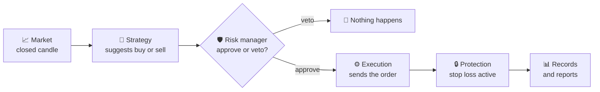

# Krypto — Engine

> A personal crypto trading engine built to learn and to test strategies, not to promise profit.

<p align="center">
  
</p>

📚 Looking for the technical details (architecture, endpoints, schemas, scripts)? See
[docs/TECNICO.md](docs/TECNICO.md) (in Portuguese).

> ⚠️ **Risk warning, before anything else**: this is a study project. It **does not promise or
> guarantee profit**. Trading crypto is risky and you can lose money. By default, Krypto only
> simulates trades with fake money (`PAPER` mode). It only gets near real money if you turn that on
> manually and explicitly. Use at your own risk.

## 1. What this project is

Krypto watches the price of a few cryptocurrencies on Binance and, following a fixed and
transparent strategy, decides when to "buy" and when to "sell". The goal is not to get rich quick.
It is a **safe and measurable** way to answer the question "would this strategy actually work?"
before risking real money (or without ever doing so).

By default it runs in simulated mode: real market prices, play money. Every decision is recorded,
so you can go back and see exactly why it bought, why it sold, and whether it made or lost money.

This repository is the engine (NestJS backend). The web app lives in
[cripto-bot-frontend](https://github.com/jacksonn455/cripto-bot-frontend).

## 2. How it works in 1 minute



1. **Market**: on every closed candle (for example, every hour) Krypto checks the price.
2. **Strategy**: applies a fixed set of rules (explained in section 4) and suggests "buy",
   "sell" or "do nothing".
3. **Risk manager**: before any order goes out, a second module checks whether it is safe to trade
   right now (is there a stop? has it already lost too much today? are too many positions open?).
   It can veto the strategy's suggestion.
4. **Execution**: only if risk approves is the order actually sent (real or simulated, depending
   on the mode).
5. **Protection**: every trade is born with a loss limit (stop loss) already set. A position is
   never left unprotected.
6. **Records**: everything (decision, reason, result) is saved and turned into reports later.

## 3. Which coins it trades

Today Krypto trades a **fixed list** of pairs, set in `.env` (`TREND_SYMBOLS`):

| Pair | What it means |
|---|---|
| `BTCUSDT` (default) | Buy/sell Bitcoin using USDT (a stable "digital dollar", 1 USDT ≈ 1 US dollar) |
| `ETHUSDT` (default) | Buy/sell Ethereum using USDT |

**Important**: there is no "smart" list that picks coins on its own yet, and no automatic filter
that excludes leveraged tokens (like `BTCUP`/`BTCDOWN`, which amplify price moves and are not
recommended for this strategy). That is only an idea for the future. What runs is exactly the list
you configure.

To add another coin, edit `TREND_SYMBOLS` in `.env` with a comma-separated list, for example:
`TREND_SYMBOLS=BTCUSDT,ETHUSDT,SOLUSDT`. The pair must exist on Binance against USDT.

## 4. The buy and sell logic

### When it BUYS

Krypto only buys when **all** of the items below are true at the same time:

- ✅ **Long-term uptrend** (the "market regime"): price is above a long-term average (EMA200 on a
  higher timeframe, e.g. 4 hours). Think of it as checking the tide before going into the sea:
  looking at a single wave is not enough.
- ✅ **Moving averages crossing up**: a faster average (short EMA) crosses above a slower one
  (long EMA). A "moving average" is just an average of recent prices, giving more weight to the
  newest ones, like tracking your average spending over the last few weeks to see the trend
  instead of looking at a single day.
- ✅ **RSI in a healthy range**: RSI is a 0–100 "thermometer" that measures whether price rose or
  fell too fast recently. Very high can mean euphoria (buying too expensive); very low can mean
  panic. Krypto only enters in a range that is "neither euphoric nor panicking".

If any of these fails, it does not buy. No exceptions.

**What about short selling?** Optional and off by default (`TREND_ALLOW_SHORT=true` turns it on).
It is the exact mirror of the rule above: long-term **downtrend**, fast average crossing **down**
and RSI in the mirrored range. The stop sits **above** the entry, and profit comes from the price
falling. It only works in simulated mode and in backtests, because Binance Spot does not let you
sell what you don't own. Details in [docs/TECNICO.md](docs/TECNICO.md#long-e-short), and the
research on when it is worth it in [docs/ESTRATEGIA-PESQUISA.md](docs/ESTRATEGIA-PESQUISA.md).

### When it SELLS

- **Stop loss**: every trade is born with a price at which, if the market falls there, Krypto
  sells to limit the loss. The stop distance comes from ATR, a measure of "how much the price
  usually swings" (a calm day gets a closer stop; a volatile day, a wider one).
- **Trailing stop** (protection that rises with the price): as price goes up, the stop follows
  behind it, locking in part of the profit, and it never moves down. So if price turns down after a
  good run, Krypto still exits with a profit instead of waiting for the original stop.
- **Opposite crossover**: if the fast average crosses back below the slow one, the uptrend has
  lost strength and Krypto exits.

### How much it puts into each trade

The rule is simple: **never risk more than a small, fixed slice of capital per trade** (1% by
default, configurable). Example:

> Capital: 1,000 USDT. Risk per trade: 1% → at most a **10 USDT loss** on this trade.
> If the distance to the stop is 200 USDT per unit, Krypto buys `10 ÷ 200 = 0.05` units: exactly
> enough that, if the stop is hit, the loss is the agreed 10 USDT (never more).

### A fictional example, start to finish

*(illustrative numbers, not a recommendation or a real result)*

**Trade 1, a win**: buy BTCUSDT at 60,000, stop at 58,000 (distance 2,000). With 1,000 USDT of
capital and 1% risk (10 USDT), position size is `10 ÷ 2,000 = 0.005 BTC`. Price rises, the trailing
stop follows, and Krypto exits at 63,000 → profit of `(63,000 − 60,000) × 0.005 = 15 USDT`.

**Trade 2, a loss**: buy BTCUSDT at 61,000, stop at 59,500 (distance 1,500). Position size:
`10 ÷ 1,500 ≈ 0.00667 BTC`. Price falls and hits the stop → loss of
`(61,000 − 59,500) × 0.00667 ≈ 10 USDT`, exactly the agreed maximum and never more.

### One last, important rule

Krypto **only decides on candles that have already closed**. It never "peeks" at the candle still
forming. This avoids a common backtest trap: deciding with information you would not have yet in
real life.

## 5. Safety: what protects you

| Protection | What it means for you |
|---|---|
| Simulated mode by default (`PAPER`) | Test as much as you want without risking any real money |
| Double confirmation to trade for real | It is impossible to turn on real mode (`LIVE`) by accident: it takes two explicit variables |
| Testnet by default | Even in real mode, orders go to Binance's test environment first, not the real market, unless you deliberately change that |
| Binance key without withdrawal permission | Even if something goes very wrong, nobody can take money out of your account, only trade within it |
| Every trade has a stop | No position is ever open without a loss limit already set |
| Emergency button (kill switch) | One command cancels everything, closes open positions and pauses trading immediately |
| Automatic pause on daily loss or consecutive stops | On a bad day Krypto stops on its own instead of trying to "win it back" (avoids the casino effect) |
| No duplicate orders | Even if the connection drops and reconnects, the same order is never sent twice |
| Never an unprotected position | If for any reason the stop cannot be placed on the exchange, Krypto closes the position right away instead of leaving it exposed |

## 6. The 3 modes

| Mode | Real money? | Real prices? | What it's for |
|---|---|---|---|
| **Backtest** | No | Yes (historical) | Test the strategy against the past, quickly |
| **Paper** | No | Yes (real time) | See how the strategy would do right now, with no risk |
| **Live** | Yes | Yes | Trade for real |

**Recommended order**: start with **Backtest**, then **Paper** for a while, and only then consider
**Live**. Within Live, start with the Binance **testnet** (also play money, but it exercises the
real order path) before even thinking about production with real money.

## 7. Following the results

Krypto records every decision and every trade, and offers ready-made reports:

- **Overall result**: number of trades, profit/loss, etc.
- **Equity curve**: how the simulated/real balance evolved over time.
- **By coin**: which pair performed best/worst.
- **By time**: which hours of the day / days of the week do better.
- **Mode comparison**: backtest vs. paper vs. live side by side.

Quick glossary:

- **Win rate**: out of every 10 trades, how many made money.
- **Profit factor**: how much was gained for each unit lost (e.g. 1.5 = gained 1.5× more than it
  lost in total).
- **Drawdown**: the biggest drop from a peak to the following low on the equity curve. It measures
  "the worst moment" you would live through.
- **Sharpe / Sortino**: how much return you get for each unit of "pain" (swings/losses) taken on.
  Higher means a better risk/return trade-off.

## 8. Project status

| Item | Status |
|---|---|
| Backtest (testing on the past) | ✅ done |
| Automatic paper trading (fake money, real prices) | ✅ done |
| Real execution (Live), code implemented | ✅ done |
| Real execution tested against actual Binance | ⏳ pending (the development environment has no network access to Binance) |
| Reports and metrics | ✅ done |
| Kill switch / automatic pause | ✅ done |
| Notifications (Discord and/or Telegram) | ✅ done (optional, configured via env) |
| Short trades | ✅ in backtest and Paper (off by default: `TREND_ALLOW_SHORT`); ❌ in Live Spot (Binance Spot does not allow short selling) |
| Analysis with OpenAI agents | ✅ done (optional, analysis only: never opens or closes trades) |
| Funding rate scanner (futures market) | ✅ done |
| Web app (dashboard) | ✅ done in [cripto-bot-frontend](https://github.com/jacksonn455/cripto-bot-frontend) |
| Dashboard authentication | ✅ optional password login (`DASHBOARD_PASSWORD` in the web app), plus the `CONTROL_API_KEY` for commands |

All 7 planned project phases are implemented. Phase-by-phase details in
[docs/TECNICO.md](docs/TECNICO.md).

## 9. Honest limitations and risks

- **No profit guarantee.** No trading system guarantees making money. This project exists to
  measure, not to promise.
- **A backtest does not guarantee the future.** A strategy that worked on past data may not work
  going forward: markets change.
- **Overfitting risk**: it is easy to tune parameters until they "nail" the past and, in doing so,
  build a strategy that only works on data you have already seen.
- **Fees are not simulated in Paper/Live** (only Backtest applies fees), so real results tend to
  be a bit worse than Paper results.
- **The coin list is fixed today**, with no automatic selection by volume/liquidity and no
  automatic exclusion of leveraged tokens (see section 3).
- **The real execution paths (Live/testnet)** were implemented following Binance's documentation
  and are covered by automated tests, but have not yet been exercised against a real connection.
  Test them yourself on the testnet before trusting them with real money.

## 10. Quick start (simulated mode)

```powershell
cp .env.example .env
pnpm install
docker compose up mongo redis -d
pnpm run start:dev
```

Then, in another terminal:

```powershell
curl http://localhost:8000/bot/status
```

That starts Krypto in `PAPER` mode (the default), with simulated money and real prices. For
everything else (other commands, endpoints, architecture, technical decisions) see
[docs/TECNICO.md](docs/TECNICO.md).

---

Nest (the framework underneath) is [MIT licensed](https://github.com/nestjs/nest/blob/master/LICENSE).
